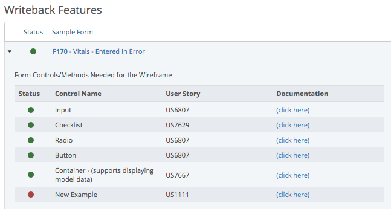
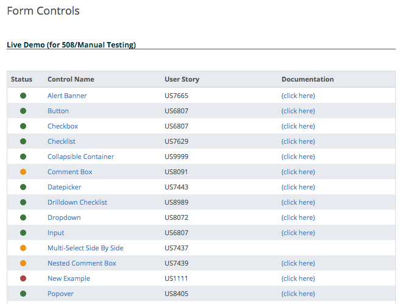
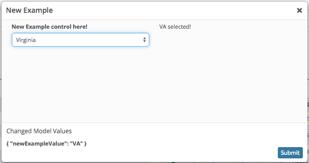

::: page-description
# Developing in the ADK #
The following guide is provided as a reference for ADK developers
:::

## ADK.UI.Form ##
::: callout
Form controls need to be designed with flexibility and usability for optimal consumption by form developers in mind. This means that config options should be consistent across controls while balancing the level of configurability to pass through to the form developers. It is also important to ensure that the controls are as efficient and memory-leak-free as possible; familiarity with Backbone and Marionette is essential to achieve this. Additionally, each control needs to be thoroughly tested to ensure lasting functionality. Finally, no control can be considered complete until it has been vetted for 508 compliance / usability for both sighted and unsighted users.
:::

### Developing Controls ###

To create a new control:
- **Create** a new control file under `product/production/main/ui_components/form/controls/`
	- The filename should be camel-case with the name equating to the name of the control (ie. 'newExample.js')
- **Register** the new control in `product/production/main/ui_components/form/component.js`. This is done by simply including the path to your control in the `define` function's array so that when the component.js is required, all of the form controls are also required.
	::: callout
	::: showcode Changes required in component.js:
	```JavaScript
	// component.js
	define([
		// ... other paths
		'main/ui_components/form/controls/newExample' // only 1 line to add
	], function() {
		// ... component.js
	});
	```
	:::
- **Write** the control functionality (in our example, newExample.js)
	1) Ensure that the file is set in in our standard require module setup with the appropriate requirements spelled out. At a minimum, you need Backbone, Marionette, Handlebars (our preferred template engine), Underscore (for helpful functions), and PuppetForm (our form library):
	::: callout
	::: showcode Setting up newExample.js:
	``` JavaScript
	// newExample.js
	define([
		'backbone',
		'marionette',
		'handlebars',
		'underscore'
	], function(Backbone, Marionette, Handlebars, _) {
		var NewExampleControl; // we haven't set up our views yet
		// a require module needs to return the item you want...
		// in this case, it will be our control, which is empty for now
		return NewExampleControl;
	});
	```
	:::

	2) Next, we create our views that will make up our control. For this example, we will be creating a control that simply displays a select as well as preview text of the currently selected option. At this time, we should also attach our control to the PuppetForm object. Doing this registers our control within PuppetForm and starts the path to making our control consumable in a form. The format should be `PuppetForm.NewExampleControl`.
		- **NOTE**: you can also directly extend existing form controls. For an example of this, please see the input control in ui_components/form/controls/input.js
	::: callout
	::: showcode Attaching control to PuppetForm and determing top-level view in newExample.js:
	``` Javascript
	var NewExampleControl = PuppetForm.NewExampleControl = Marionette.LayoutView.extend();
	// still empty but now our views are almost ready to go
	return NewExampleControl;
	```
	:::

	3) Now that our basic structure of our control is set up, we now want to extend the default control implementation. Doing this will greatly reduce the amount of code required. At this time we will create another object variable which will contain the view's attributes.
	::: callout
	::: showcode Extending control to use PuppetForm.CommonPrototype in newExample.js:
	``` JavaScript
	var NewExample = {};
	var NewExampleControl = PuppetForm.NewExampleControl = Marionette.LayoutView.extend(
		_.defaults(NewExample, _.defaults(PuppetForm.CommonPrototype, PuppetForm.CommonEventsFunctions))
	);
	return NewExampleControl;
	```
	:::

	4) We are ready to set up our view. For starters, we need to create a template. Since our control is a Marionette.LayoutView, we want to define regions in our template. Since we're creating a control with two parts, we can start with two regions.
	::: callout
	::: showcode Setting up top level view in newExample.js:
	``` JavaScript
	var NewExample = { // rememeber, this is a layout view
        template: Handlebars.compile([
        // col-xs-6 put on in order to have the two side by side
            '<div class="new-example-dropdown-region col-xs-6"></div>',
            '<div class="new-example-text-region col-xs-6"></div>'
        ].join('\n')),
        ui: {
            'DropdownRegionDiv': '.new-example-dropdown-region',
            'TextRegionDiv': '.new-example-text-region'
        },
        regions: {
        // when possible, use the ui hash for improved maintainability and performance
            'DropdownRegion': '@ui.DropdownRegionDiv',
            'TextRegion': '@ui.TextRegionDiv'
        }
    };
    var NewExampleControl = PuppetForm.NewExampleControl = Marionette.LayoutView.extend(
        _.defaults(NewExample, _.defaults(PuppetForm.CommonPrototype, PuppetForm.CommonEventsFunctions))
    );
    return NewExampleControl;
	```
	:::

	5) Next, we want utilize PuppetForm.CommonPrototype and do all the initialize magic that lets the control work. Depending on what you're doing with your control, you may need additional functions in order for your control to work properly.
	::: callout
	::: showcode Calling CommonProtoype functions enabling correct functionality in newExample.js:
	``` JavaScript
	var NewExample = { // rememeber, this is a layout view
        // ... template, regions, and ui hidden for brevity
        initialize: function(options) {
        	// see PuppetForm.CommonPrototype in _assets/libs/custom/puppetForm.js
        	// in order to view what these functions are doing
            this.initOptions(options);
            this.setFormatter();
            this.listenToFieldOptions();
            // end CommonPrototype functions
        }
    };
    var NewExampleControl = PuppetForm.NewExampleControl = Marionette.LayoutView.extend(
        _.defaults(NewExample, _.defaults(PuppetForm.CommonPrototype, PuppetForm.CommonEventsFunctions))
    );
    return NewExampleControl;
	```
	:::

	6) Now that our layout view is all set up, we then need to put views in the regions. We'll start with the dropdown view first. We will be using the dropdown control that is already created. We want to create a new `PuppetForm.SelectControl` with the options required for minimal functionality. The required options can be found in the [Select Control's Documentation](form-controls.md#Select).
		- **NOTE:** At this point, you would probably want to view this working on the demo page. Follow the [Demoing Controls Instructions](developing-adk.md#Demoing-Controls) to get started.
	::: callout
	::: showcode Adding instance of select control in newExample.js:
	``` JavaScript
	var NewExample = { // rememeber, this is a layout view
        // ... template and ui hidden for brevity
        regions: {
            'DropdownRegion': '@ui.DropdownRegionDiv',
            'TextRegion': '@ui.TextRegionDiv'
        },
        initialize: function(options) {
        	// ... CommonPrototype functions here, hidden for brevity
            var commentInputViewField = new PuppetForm.Field({
                control: "select",
                name: this.field.get('name'),
                label: this.field.get('label'),
                pickList: this.field.get('pickList')
            });
            this.dropdownView = new PuppetForm.SelectControl({
                field: commentInputViewField,
                model: this.model // refers (most often) to the form's model
            });
        },
        onShow: function() {
        // onBeforeShow would be preferred, but ADK.UI.Form is currently a composite view
        // and doesn't fire onBeforeShow
        	this.showChildView('DropdownRegion', this.dropdownView);
        }
    };
    var NewExampleControl = PuppetForm.NewExampleControl = Marionette.LayoutView.extend(
        _.defaults(NewExample, _.defaults(PuppetForm.CommonPrototype, PuppetForm.CommonEventsFunctions))
    );
    return NewExampleControl;
	```
	:::

	7) After our select control is all set up, we can add our preview text view. Instead of inserting another control, we will be providing our own view. The important things to pass in are the control's model and field. These are used to map the preview text view's template to the correct value from the select.
	::: callout
	::: showcode Adding preview text view to newExample.js
	``` JavaScript
	var PreviewTextView = Marionette.ItemView.extend({
        template: Handlebars.compile([
        // notice the if used to avoid an empty <p> tag
            '{{#if value}}' +
            '<p class="new-example-preview-text">{{value}} selected!</p>' +
            '{{/if}}'
        ].join('\n')),
        modelEvents: function() {
        // we need to tell the view to rerender any time the select's value changes
        	var modelEventsObject = {};
        	modelEventsObject['change:' + this.field.get('name')] = 'render';
        	return modelEventsObject;
        },
        initialize: function(options) {
        // need to assign the options passed in to this view
        	this.field = options.field;
        },
        serializeModel: function(model) {
        // this is why we needed model and field
        	var data = {
        		value: model.get(this.field.get('name'))
        	};
        	return data;
        }
    });
    var NewExample = { // rememeber, this is a layout view
        // ... template and ui hidden for brevity
        regions: {
            'DropdownRegion': '@ui.DropdownRegionDiv',
            'TextRegion': '@ui.TextRegionDiv'
        },
        initialize: function(options) {
            // ... CommonPrototype functions and dropdownView's init hidden for brevity
            this.previewTextView = new PreviewTextView({
            	model: this.model, // generally will be the form's model
            	field: this.field // available after this.initOptions is called
            });
        },
        onShow: function() {
            this.showChildView('DropdownRegion', this.dropdownView);
            this.showChildView('TextRegion', this.previewTextView);
        }
    };
    var NewExampleControl = PuppetForm.NewExampleControl = Marionette.LayoutView.extend(
        _.defaults(NewExample, _.defaults(PuppetForm.CommonPrototype, PuppetForm.CommonEventsFunctions))
    );
    return NewExampleControl;
	```
	:::

- **Finished!** Here's newExample control we have so far. It should be working and look somewhat like this:
	
	::: callout
	::: showcode Finished newExample.js:
	```JavaScript
	// newExample.js
	define([
	    'backbone',
	    'marionette',
	    'handlebars',
	    'underscore',
	    'puppetForm'
	], function(Backbone, Marionette, Handlebars, _, PuppetForm) {
	    var PreviewTextView = Marionette.ItemView.extend({
	        template: Handlebars.compile([
	            '{{#if value}}' +
	            '<p class="new-example-preview-text">{{value}} selected!</p>' +
	            '{{/if}}'
	        ].join('\n')),
	        modelEvents: function() {
	        	var modelEventsObject = {};
	        	modelEventsObject['change:' + this.field.get('name')] = 'render';
	        	return modelEventsObject;
	        },
	        initialize: function(options) {
	        	this.field = options.field;
	        },
	        serializeModel: function(model) {
	        	var data = {
	        		value: model.get(this.field.get('name'))
	        	};
	        	return data;
	        }
	    });
	    var NewExample = { // rememeber, this is a layout view
	        template: Handlebars.compile([
	            '<div class="new-example-dropdown-region col-xs-6"></div>',
	            '<div class="new-example-text-region col-xs-6"></div>'
	        ].join('\n')),
	        ui: {
	            'DropdownRegionDiv': '.new-example-dropdown-region',
	            'TextRegionDiv': '.new-example-text-region'
	        },
	        regions: {
	            'DropdownRegion': '@ui.DropdownRegionDiv',
	            'TextRegion': '@ui.TextRegionDiv'
	        },
	        initialize: function(options) {
	            // see PuppetForm.CommonPrototype in _assets/libs/custom/puppetForm.js
	            // in order to view what these functions are doing
	            this.initOptions(options);
	            this.setFormatter();
	            this.listenToFieldOptions();
	            // end CommonPrototype functions
	            var commentInputViewField = new PuppetForm.Field({
	                control: "select",
	                name: this.field.get('name'),
	                label: this.field.get('label'),
	                pickList: this.field.get('pickList')
	            });
	            this.dropdownView = new PuppetForm.SelectControl({
	                field: commentInputViewField,
	                model: this.model
	            });
	            this.previewTextView = new PreviewTextView({
	            	model: this.model,
	            	field: this.field
	            });
	        },
	        onShow: function() {
	            this.showChildView('DropdownRegion', this.dropdownView);
	            this.showChildView('TextRegion', this.previewTextView);
	        }
	    };
	    var NewExampleControl = PuppetForm.NewExampleControl = Marionette.LayoutView.extend(
	        _.defaults(NewExample, _.defaults(PuppetForm.CommonPrototype, PuppetForm.CommonEventsFunctions))
	    );
	    return NewExampleControl;
	});
	```
	:::

::: definition
Your new control is now created and registered, but nothing is using it yet. If you haven't already, see the [Demoing Controls](#Demoing-Controls) section to set it up for the demo page. This was a very simple example, feel free to look at other [ADK.UI.Form controls](form-controls.md) to get an idea of what can be provided in this framework.
:::

### Demoing Controls ###
The demo page is available at: [locally deployed app url]/#ui-components-demo <br />(ie. https://IP        /#ui-components-demo)

In order for your control to be displayed on the demo page, the following steps must be followed:
- **Control exists:** The control must be set up as specified in the [Developing Controls](#Developing-Controls) section.
- **Register** the control in the demo page's form control manifest: `product/production/demo_files/feature_forms/formControls.js`
	- Add an object to the array of controls with:
		- **id**: (string) name of control
		- **label**: (string) pretty version of name to be displayed on demo page
		- **developmentStatus**: (boolean) whether or not it is functional barring styling/508 approval
		- **cometStatus**: (boolean) has been vetted for approved styles and 508 compliance
		- **exampleForm**: (boolean) must be true to see a demo of the control
		- **supportsErrorMessage**: (boolean) determines if errorMessage functionality is put into control's example form
		- **storyNumber**: (integer) maps to Rally story number (leave the 'US' OFF of this number)
		- **documentationURL**: (string) link to control's ADK documentation. Ensure the link works before forgetting about it. (example: `"/documentation/#/adk/form-controls#Control-Name"`)
	::: callout
	::: showcode Example control config in formControls.js:
	``` JavaScript
	{
        id: 'newExample',
        label: 'New Example',
        developmentStatus: false,
        cometStatus: false,
        exampleForm: true,
        supportsErrorMessage: false,
        storyNumber: 1111,
        documentationURL: "/documentation/#/adk/form-controls#New-Example"
	}
	```
	:::
- **Configure** the control's sample form in the demo page's field config manifest: `product/production/demo_files/form_components_example/fields.js`
	- Add an attribute to the field object (the large one in the return statement)
		- the attribute name should match the **id** attribute in the control's config in the form control manifest
		- the value of that attribute is an array of control fields
	::: callout
	::: showcode Example sample form config for newExample control in fields.js:
	``` JavaScript
	return {
		newExample: [{
			control: 'newExample',
            name: 'newExampleValue',
            label: 'New Example control here!',
            pickList: [{
                value: 'AL',
                label: 'Alabama'
            }, {
                value: 'NY',
                label: 'New York'
            }, {
                value: 'VA',
                label: 'Virginia'
            }]
		}]
	}
	```
	:::
- **Map** the control to the forms that require it. This is done by adding a string (equal to the control's **id**) to the `control` array of each feature in `product/production/demo_files/feature_forms/featureStatus.js`. Doing this will let the feature display the control as a dependency.
	::: callout
	::: showcode Example of adding control to controls array in featureStatus.js:
	``` Javascript
	{
        featureNumber: 170,
        title: "Vitals - Entered In Error",
        wireframe: "http://h352jh.axshare.com/#p=f170_vitals_-_entered_in_error_v_2",
        workflowPath: "http://IP        /ui-components/docs/workflow/psi9/workflow-vital-eie.pdf",
        workflowSize: "338KB",
        useCaseScenarioPath: "http://IP        /ui-components/docs/use-case/psi9/Test-Scenario-vitals-ELE.pdf",
        useCaseScenarioSize: "83KB",
        controls: ['input','checklist','radio','button','container_showingModelData', 'newExample'], // here!!!!!
        components: ['workflow','alert','growlNotifications'],
        notes: "",
        exampleForm: true,
        handOff: {
            trifecta: true,
            dev: true
        }
	}
	```
	:::
- **Finished!** Now the control will be mapped to its features as well as have a demo form.
	- Here is what it would look like in the Feature Status section:
	
	- And here it is in the Form Controls Live Demo table:
	
	- And finally, here is what it would look like in its sample form:
	


### Documenting Controls ###
The ADK documentation lives in `product/production/documentation/adk/`. When including an image, simply place the image in the `assets/` directory.

The important part here is to accurately group your control for placement within the [Form Controls documentation](form-controls.md) page. After you have determined which group to place your control, simply insert its documentation in alphabetical order within that group.
::: definition
Groups:
- **Basic**: Simple HTML form controls. New controls probably won't go in this group. (ie. Input, Select)
- **Utility**: These controls will have a specific function but are widely used. (ie. Datepicker, Checklist)
- **Wrappers**: The primary purpose of these controls are to be containers for other controls. (ie. Popover, Fieldset)
- **Special**: These are highly specialized, very complex, and not very flexible. (ie. Nested Comment Box, Toggle Options Checklist)
:::

::: side-note
**Note**: Make sure to include the config options, a sample image (or images), available trigger events, and sample code configurations.
:::

::: callout
Once your documentation for your control is complete, be sure to add an entry in the [What's New? Page](changelog.md)
:::


### Testing Controls ###
Coming soon.
