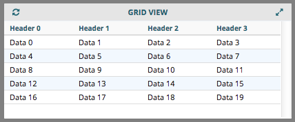
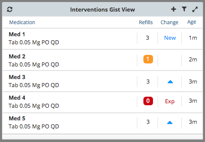
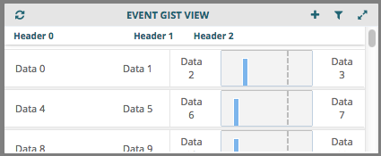

::: page-description
# Applet Views #
ADK UI Library's Standardized Marionette Views
:::

::: definition
Applet Views can be accessed and used by calling:
### **ADK.UI.[applet-view-name]** ###
:::

## ServerPagingApplet ##
Returns a LayoutView complete with a [**filter**](views.md#Text-Filter) view, [**table**](views.md#Table) view (now a Marionette view instead of a Backgrid view), and built in functions to manage the state of a table with server paging. This view is largely configuration based, yielding consistent yet flexible functionality. The initialize function should define `this.collection` with a [ADK.Collections.ServerCollection](../using-adk.md#Collections-ServerCollection) (or one that extends it). This view is designed to be used as the the top-level applet view, i.e. the view returned by the applet configuration in `applet.js`.

Note that once `this.collection` is set, a fetch is fired off, so make sure to set appropriate fetch options when instantiating. See Basic Usage code sample for example.

Also, `this.tableOptions` can be set with column configuration, or `this.getColumns` (see code sample for more info).

### Basic Usage ###
```JavaScript
var MyCollection = ADK.Collections.ServerCollection.extend({});
var ServerPagingView = ADK.UI.ServerPagingApplet.extend({
  defaultSortedColumn: COLUMNS[0].name, // function (returns string) or string matching 'name' attribute
  helpers: {}, // passed into Table view, see Table view docs for more info
  initialize: function() {
    // fetch fired immediately -- this.beforeFetch can be used as a
    // pre-fetch patch function
    this.collection = new MyCollection([], fetchOptions);
  },
  onClickRow: function(model) {
    // called on click of Table row
  },
  getColumns: function() {
    // place to have conditional logic on which columns to use
    return COLUMNS; // see table view for more info on column configuration
    // by default, does _.get(this.getOption('tableOptions'), 'columns', [])
  },
  beforeFetch: function() {
    // fired before fetch (i.e. when collection is instantiated)
    // Note: this.collection is available in scope at this point
  }
});
```

### Default Sorted Column ###
The ServerPagingView should have a column assigned as the default. This will drive the initial sort as well as the fall-back sort after other columns' sorts are cycled through. This can be done as shown below. The string value should match the `name` attribute on the desired [column configuration](views.md#Table-Column-Configuration). Doing this will allow the view to properly bootstrap the [table view](views.md#Table) to the correct column.

```JavaScript
// given the array of objects `columns`
var ExampleServerPagingView = ADK.UI.ServerPagingApplet.extend({
  defaultSortColumn: columns[0].name // string/function (returns string) matching desired column's `name`
});
```

## BaseDisplayApplet ##

ADK.UI.BaseDisplayApplet encapsulates the following commonly used applet functionality: **text filtering**, **date filtering**, **collection refreshing**, and **write back eventing**

ADK.Applets.BaseDisplayApplet encapsulates the following commonly used applet functionality: **text filtering**, **date filtering**, **collection refreshing**, and **write back eventing**

### Options ###
When extending BaseDisplayApplet, the following attributes can be set in the view's **appletOptions** object:

| Required                                | Attribute                | Description                                                                 |
|-----------------------------------------|--------------------------|-----------------------------------------------------------------------------|
|<i class="fa fa-check-circle center"></i>| **collection**           | backbone collection that is used to populate AppletView |
|<i class="fa fa-check-circle center"></i>| **AppletView**           | view that displays the details/models of the collection |
|                                         | **toolbarView**          | view to be displayed above the AppletView |
|                                         | **filterFields**         | array of strings that point to attributes in the collection's models in which to enable text filtering |
|                                         | **filterDateRangeField** | object with string attributes (_name, label, format_) that configures how the collection is filtered by date |
|                                         | **refresh**              | method to be called for refresh collection event |
|                                         | **onClickAdd**           | method to be called for write-back event |

ADK.Applets.BaseDisplayApplet has the following methods: _intitialize_, _onRender_, _onShow_, _setAppletView_, onSync, _onError_, _loading_, _refresh_, _buildJdsDateFilter_, _dateRangeRefresh_, _showFilterView_

> **Note:**  assigning a **_super** attribute equal to ADK.Applets.BaseDisplayApplet.prototype, in the extending view, allows applet developers to augment BaseDisplayApplet's methods. If the extending view also contains a method with the same name, be sure to use the **_super** attribute to call the corresponding BaseDisplayApplet method (e.g. _this._super.[method name].apply(this, arguments)_)

### Basic Usage ###
```JavaScript
define([
  'main/ADK',
  'underscore',
  'handlebars'
], function (ADK, _, Handlebars) {

  var SimpleView = Backbone.Marionette.ItemView.extend({
      template: Handlebars.compile("<li>Name: <%= name %> Age: <%= age %></li>")
  });

  var CollectionView = Backbone.Marionette.CollectionView.extend({
    childView: SimpleView,
    tagName: "ul"
  });

  var ToolBarView = Backbone.Marionette.ItemView.extend({
    template: Handlebars.compile("<div>I am a ToolBarView</div>")
  });

  var SampleView = ADK.Applets.BaseDisplayApplet.extend({
    // use super to reference ADK.UI.BaseDisplayApplet's methods
    super: ADK.Applets.BaseDisplayApplet.prototype,
    initialize: function(options){
      /* always need to define this.appletOptions in the initialize
       * with a minimum of the required attributes
       *
       * see the above table for attributes that are required
       */
      this.appletOptions = {
        collection: new Backbone.Collection([
          {name: "Tim", age: 5, dob: "20100101"},
          {name: "Ida", age: 26, dob: "19890101"},
          {name: "Rob", age: 55, dob: "19600101"}
        ]),
        AppletView: CollectionView,
        filterFields: ['name', 'age'],
        filterDateRangeField: {
          name: "dob",
          label: "Date of Birth",
          format: "YYYYMMDD"
        },
        toolbarView: new ToolBarView
      }

      // calling ADK.Applets.BaseDisplayApplet's initialize method
      this._super.initialize.apply(this, arguments);
    }
  });

  var appletConfig = {
    id: 'sampleApplet',
    viewTypes: [{
      type: 'base',
      view: SampleView
    }],
    defaultViewType: 'base'
  };

  return appletConfig;
});
```

## GridApplet ##
ADK.UI.GridApplet



Extended from **ADK.UI.BaseDisplayApplet**, GridApplet is a straight forward DataGrid applet that focuses on displaying more inclusive and explicit data sets. The applet's collection is rendered in table format with rows and columns, with built in text filtering (from BaseDisplayApplet) and column sorting (provided the appropriate requirements are met).

Functionality provided by GridApplet in addition to that already provided by BaseDisplayApplet are as follows:
- **infinite scrolling** : if the collection passed in with appletOptions is of type Backbone.PageableCollection
- **column sorting** : enabled by default since passing in an appletOptions.columns attribute is a requirement for GridApplet

### Options ###
This view can be extended and customized by an applet developer by setting the view's _appletOptions_ object. Below are the additional **appletOptions** available/required with GridApplet:

| Required     | Option          | Type   |Description                                                                                                                               |
|--------------|-----------------|--------|------------------------------------------------------------------------------------------------------------------------------------------|
|              | **onClickRow**  | method | handles event when user clicks a row.     |
|              | **detailsView** | view   | if specified and onClickRow is not in appletOptions, will be shown between the row clicked on and the next row. |
|<i class="fa fa-check-circle note center">*</i> | **columns** | array of objects | specified column objects are used to config what columns to display |
|<i class="fa fa-check-circle note center">*</i> | **summaryColumns** | array of objects | specified column objects are used to config what columns to display (on a screen with "fullScreen: false" specified in the applet's screen config) |
|<i class="fa fa-check-circle note center">*</i> | **fullScreenColumns** | array of objects | specified column objects are used to config what columns to display (on a screen with "fullScreen: true" specified in the applet's screen config) |
|              | **groupable** | boolean | (default: _false_) set to true to enable the groupable behavior |

::: callout
 **Note:** specifying neither onClickRow nor detailsView will result in nothing happening when a row is clicked, unless specified in an applet event.
:::

::: callout
 **<i class="fa fa-check-circle note"></i>\***: it is required to either have a **columns** or **summaryColumns** or **fullScreenColumns** attribute specified. (_summaryColumns_ and _fullScreenColumns_ take precedence over the _columns_ attribute) All three attributes correspond to an array of objects that have the following attributes, listed in the box below:
:::

### Column Options ###
- **name** : Model key mapped to collection
- **label** : Column heading displayed in table
- **cell** : [Cell type](http://backgridjs.com/ref/cell.html) (default "string")
- **template** : Optional handlebars template for use with cell: "handlebars"
- **sortable** : Enable sorting (default true)
- **renderable** : Enable rendering (default true)
- **groupable** : Enable grouping (default false)
- **groupableOptions** : object with grouping options

### Grouping in GridApplet ###
In addition to grouping rows, two other pieces of grouping options.
- Group Header - This is a row that is inserted at the top of the group. Clicking on the row either hides all of the rows in that group, providing a count in the header row, or it shows all of the rows in that group.
- Clicking on column headers changes the group by category - When a column header is clicked, the grid is regrouped by that column.
    For example, when the Entered By column is clicked on, the grid will group all of the providers with the same name together.
    Note: On the third click of a column header, the grid reverts back to what it looked like before you started clicking on headers (the same view that was loaded with the page)

To enable the behavior, several things need to be done. Firstly, appletOptions.groupable needs to be true.
The second thing that needs to be done, is that the columns need to be configured properly.
Much of the grouping functionality is modeled after Backgrid's sorting behavior.

#### Column.**groupableOptions** Attributes ####
- **primary** : (_optional_) (default: _false_) : When a column is marked primary, when the grid is loaded, refreshed, or on the '3rd click', the grid is grouped by this column. At least one column should be marked as primary innerSort - In practice, this isn't optional. The requirements are that the groups should be sorted in reverse chronological order (most recent at the top). In theory, it is optional. The group sort will be the insertion order into the collection without it. (needs to be tested).
- **groupByFunction** : (_optional_) : Defaults to the name of the column. You can pass in an optional function. Dictates the sorting key - all rows that return the same result of this function will be grouped together.  You can access the model via collectionElement.model. Handy for grouping by date ranges. (year & month for example)
- **groupByRowFormatter** : (_optional_) : Defaults to the name of the column. Whatever this function returns is what will be displayed as the group header.

### Basic Usage ###
The following is a sample implementation of a GridApplet applet
```JavaScript
define([
  'main/ADK',
  'underscore'
], function (ADK, _) {

    var sampleColumns = [{      // Specifies which columns are included and enables column sorting
      name: 'name',           // field mapped to in collection
      label: 'Name',          // displayed in the table
      cell: 'string'
    }, { // this column is not groupable or sortable. Clicking on the column will do nothing.
      name: 'description',
      label: 'Description',
      cell: 'string',
      sortable: false
    }, {
      name: 'observedDate',
      label: 'Date',
      cell: 'string'
    }, {
      //this column takes 2 optional groupableOptions, groupByFunction & groupByRowFormatter
      name: 'kind',
      label: 'Type',
      cell: 'string',
      groupable:true,
      groupableOptions: {
          primary:true,  //When a column is marked primary, when the grid is loaded, refreshed, or on the '3rd click', the grid is grouped by this column
          innerSort: "activityDateTime", //this is reverse chronological (desc) order.
      }
    }, {
      //this column takes 2 optional groupableOptions, groupByFunction & groupByRowFormatter
      //this is because we want to group by year & month.
      name: 'activityDateTime',
      label: 'Date & Time',
      cell: 'handlebars',
      template: formatDateTemplate,
      groupable:true,
      groupableOptions: {
        innerSort: "activityDateTime", //in practice, this isn't optional. In theory it is (not tested though)
        groupByFunction: function(collectionElement) {
            return -collectionElement.model.get("activityDateTime").substr(0,6);
        },
        //this takes the item returned by the groupByFunction
        groupByRowFormatter: function(item) {
            return moment(item, "YYYYMM").format("MMMM YYYY");
        }
      }
    }];

   var fetchOptions = {
        resourceTitle: 'example-resource',
        pageable: true                    // enables infinite scrolling (makes a pageable collection)
    };

  var SampleGridApplet = ADK.UI.GridApplet.extend({
    // use super to reference ADK.UI.GridApplets's methods
    super: ADK.UI.GridApplet.prototype,
    initialize: function(options){
      this.appletOptions = {
        columns: sampleColumns,
        collection: ADK.UI.PatientRecordService.fetchCollection(fetchOptions),
        filterFields: ['name', 'description'],
        filterDateRangeField: {
          name: "observedDate",
          label: "Date",
          format: "YYYYMMDD"
        },
        onClickRow: this.sampleOnClickRowHandler
      }

      // calling ADK.UI.GridApplet's initialize method
      this._super.initialize.apply(this, arguments);
    },
    // event handler for row click. Opens a modal with the detailed view
    sampleOnClickRowHandler : function(model, event) {
      var view = new ModalView({model: model});
      var modalOptions = {
        title: 'Details'
      }
      ADK.showModal(view, modalOptions);
    }
  });

  var appletConfig = {
    id: 'sampleGridApplet',
    viewTypes: [{
      type: 'grid',
      view: SampleGridApplet,
      chromeEnabled: true
    }],
    defaultViewType: 'grid'
  };

  return appletConfig;
});

```

## PillsGistApplet ##
ADK.UI.PillsGistApplet


PillsGistApplet is a simple gist view that displays only the amount of data required to differentiate between other entries (ie. An allergies applet only displaying the name of an allergy per pill) in a pill shaped button/container.

### Options ###
This view can be extended and customized by an applet developer by setting the view's _appletOptions_ object. Below are the additional **appletOptions** available/required with PillsGistApplet:

| Required     | Option               | Type   |Description                                                                                                                               |
|--------------|----------------------|--------|------------------------------------------------------------------------------------------------------------------------------------------|
|<i class="fa fa-check-circle center"></i> | **gistModel**        | array  | array of objects with attributes id and field (ie. [{id: 'name', field: 'summary'}]).|
|              | **collectionParser** | method | returns a manipulated/parsed collection |

### Basic Usage ###
The following is a sample implementation of a PillsGistApplet sample applet.

```JavaScript
define([
  'main/ADK',
  'underscore'
], function (ADK, _) {

    var fetchOptions = {
        resourceTitle: 'example-resource'
    };

    var samplePillsGistApplet = ADK.UI.PillsGistApplet.extend({
        ._super:  ADK.UI.PillsGistApplet.prototype,
        initialize: function(options) {
            var self = this;
            this.appletOptions = {
                filterFields: ["name"],
                filterDateRangeField: {
                  name: "dob",
                  label: "Date of Birth",
                  format: "YYYYMMDD"
                },
                collectionParser: self.transformCollection,
                gistModel: self.gistModel,
                collection: ADK.PatientRecordService.fetchCollection(fetchOptions)
            };
            this._super.initialize.apply(this, arguments);
        },
        transformCollection: function(collection) {
            return collection;
        },
        gistModel: [{
              id: 'name',
              field: 'name'
          }]
        }
    });
    var appletConfig = {
        id: 'samplePillsGistApplet',
        viewTypes: [{
          type: 'gist',
          view: samplePillsGistApplet
        }],
        defaultViewType: 'gist'
  };

  return appletConfig;
});

```

## InterventionsGistApplet ##
ADK.UI.InterventionsGistApplet



The InterventionsGistApplet view displays data in a table format with cell formatting, to help the user to determine critical values.

### Options ###
This view can be extended and customized by an applet developer by setting the view's _appletOptions_ object. Below are the additional **appletOptions** available/required with InterventionsGistApplet:

| Required     | Option               | Type   |Description                                                                                                                               |
|--------------|----------------------|--------|------------------------------------------------------------------------------------------------------------------------------------------|
|<i class="fa fa-check-circle center"></i>| **gistModel** | array  | array of objects with attributes id and field (ie. [{id: 'name', field: 'summary'}]). |
|              | **collectionParser** | method | returns a manipulated/parsed collection |
|              | **gistHeaders**      | object | configuration object for column headers which will be displayed and sortable. |
|              | **onClickRow**       | method | event handler for when user clicks on a row. Will default to opening a popover containing most recent events |

### Basic Usage ###
The following is a sample implementation of a InterventionsGistApplet sample applet.

```JavaScript
define([
  'main/ADK',
  'underscore'
], function onResolveDependencies(ADK, _) {

    var fetchOptions = {
        resourceTitle: 'example-resource'
    };

    var sampleInterventionsGistApplet = ADK.UI.InterventionsGistApplet.extend({
        ._super:  ADK.UI.InterventionsGistApplet.prototype,
        initialize: function(options) {
            var self = this;
            this.appletOptions = {
                filterFields: ["name"],
                filterDateRangeField: {
                  name: "dob",
                  label: "Date of Birth",
                  format: "YYYYMMDD"
                },
                gistHeaders: {
                  name: {
                    title: 'Name',
                    sortable: true,
                    sortType: 'alphabetical'
                  },
                  description: {
                    title: 'Description',
                    sortable: false
                  },
                  graphic: {
                      title: '',
                      sortable: true,
                      sortType: 'alphabetical'
                  },
                  age: {
                      title: 'Age',
                      sortable: true,
                      sortType: 'date'
                  },
                  count: {
                      title: 'Refills',
                      sortable: true,
                      sortType: 'numerical'
                  }
                },
                collectionParser: self.transformCollection,
                gistModel: self.gistModel,
                collection: ADK.PatientRecordService.fetchCollection(fetchOptions)
            };
            this._super.initialize.apply(this, arguments);
        },
        transformCollection: function(collection) {
            return collection;
        },
        gistModel: [{
              id: 'name',
              field: 'name'
          }]
        }
    });
    var appletConfig = {
        id: 'sampleInterventionsGistApplet',
        viewTypes: [{
          type: 'gist',
          view: sampleInterventionsGistApplet
        }],
        defaultViewType: 'gist'
  };

  return appletConfig;
});

```

## EventsGistApplet ##
ADK.UI.EventsGistApplet



The EventsGistApplet viewType is a more complicated gist featuring clumping of recurring data points (ie. if a patient gets a flu shot every year). Another feature of this gist is an in-line graph that displays occurrences over time, useful for the user to determine quickly how many and how recently these events occur. This gist view also displays events in a column/row structure with built in column sorting.

### Options ###
This view can be extended and customized by an applet developer by setting the view's _appletOptions_ object. Below are the additional **appletOptions** available/required with EventsGistApplet:

| Required     | Option               | Type   |Description                                                                                                                               |
|--------------|----------------------|--------|------------------------------------------------------------------------------------------------------------------------------------------|
|<i class="fa fa-check-circle center"></i>| **gistModel** | array  | array of objects with attributes id and field (ie. [{id: 'name', field: 'summary'}]). |
|              | **collectionParser** | method | returns a manipulated/parsed collection |
|              | **gistHeaders**      | object | configuration object for column headers which will be displayed and sortable. |
|              | **onClickRow**       | method | event handler for when user clicks on a row. Will default to opening a popover containing most recent events |

### Basic Usage ###
The following is a sample implementation of a EventsGistApplet sample applet.

```JavaScript
define([
  'main/ADK',
  'underscore'
], function (ADK, _) {

    var fetchOptions = {
        resourceTitle: 'example-resource'
    };

    var sampleEventsGistApplet = ADK.UI.EventsGistApplet.extend({
        ._super:  ADK.UI.EventsGistApplet.prototype,
        initialize: function(options) {
            var self = this;
            this.appletOptions = {
                filterFields: ["name"],
                filterDateRangeField: {
                  name: "dob",
                  label: "Date of Birth",
                  format: "YYYYMMDD"
                },
                gistHeaders: {
                  name: {
                    title: 'Name',
                    sortable: true,
                    sortType: 'alphabetical',
                    key: 'groupName'
                  },
                  acuityName: {
                    title: 'Acuity',
                    sortable: true,
                    sortType: 'alphabetical',
                    key: 'acuityName'
                  },
                  graph: {
                    title: '',
                    sortable: false,
                  },
                  itemsInGraphCount: {
                    title: 'Hx Occurrence',
                    sortable: true,
                    sortType: 'numeric',
                    key: 'encounterCount'
                  },
                  age: {
                    title: 'Age',
                    sortable: true,
                    sortType: 'date',
                    key: 'timeSinceDateString'
                  }
                },
                collectionParser: self.transformCollection,
                gistModel: self.gistModel,
                collection: ADK.PatientRecordService.fetchCollection(fetchOptions)
            };
            this._super.initialize.apply(this, arguments);
        },
        transformCollection: function(collection) {
            return collection;
        },
        gistModel: [{
              id: 'name',
              field: 'name'
          }]
        }
    });
    var appletConfig = {
        id: 'sampleEventsGistApplet',
        viewTypes: [{
          type: 'gist',
          view: sampleEventsGistApplet
        }],
        defaultViewType: 'gist'
  };

  return appletConfig;
});

```